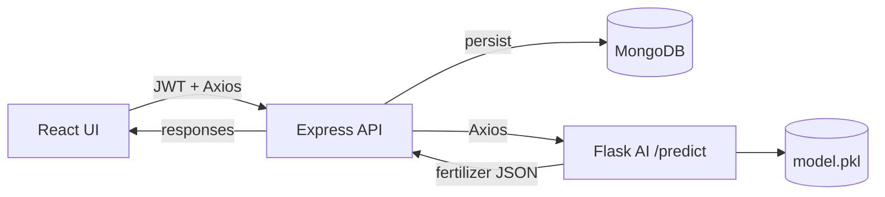

# Smart Fertilizer Usage Optimization System

A comprehensive AI-powered system for optimizing fertilizer usage in agriculture. This system uses machine learning models to analyze soil parameters and provide intelligent fertilizer recommendations.

## 🌟 Features

- **AI-Powered Recommendations**: Random Forest ML models for accurate fertilizer type and quantity predictions
- **Soil Health Analysis**: Comprehensive deficiency analysis and health scoring
- **Data Analytics**: Interactive charts and graphs for tracking soil health over time
- **User Authentication**: Secure JWT-based authentication system
- **History Tracking**: Keep track of all recommendations and soil data
- **Responsive UI**: Modern, mobile-friendly interface built with React and Tailwind CSS

## 🏗️ System Architecture

```
├── frontend/          # React.js frontend application
├── backend/           # Node.js + Express.js backend API
└── ai-model/          # Python ML models and Flask API
```

- Visual diagram (Mermaid) is available in `docs/architecture.md`.
- End-to-end flow: Soil data ➜ Backend ➜ AI microservice ➜ MongoDB & UI dashboards.



## 📋 Prerequisites

- **Node.js** (v16 or higher)
- **Python** (v3.8 or higher)
- **MongoDB** (v4.4 or higher)
- **npm** or **yarn**

## 🚀 Installation & Setup

### 1. Clone the Repository

```bash
git clone <repository-url>
cd AI-FERTLIZER
```

### 2. AI Model Setup

> ⚠️ **Python version**: use Python 3.8 - 3.12 for the pinned ML packages. Python 3.13+ may fail to install older NumPy / scikit-learn wheels.

```bash
cd ai-model

# Install Python dependencies
pip install -r requirements.txt

# Generate sample dataset
python generate_dataset.py

# Train the models
python train_model.py

# Start Flask API server
python app.py
```

The AI model API will run on `http://localhost:5000`

**Artifacts generated**
- `soil_fertilizer_dataset.csv` — synthetic training dataset (2000 samples)
- `model.pkl` — consolidated Random Forest bundle (classifier + regressors + label encoder)
- Legacy individual `.pkl` files remain for compatibility

### 3. Backend Setup

```bash
cd backend

# Install dependencies
npm install

# Create .env file (copy from env.template)
# Update MONGODB_URI and JWT_SECRET

# Start MongoDB (if not running)
# Windows: Start MongoDB service
# Linux/Mac: mongod

# Start backend server
npm start
# or for development
npm run dev
```

The backend API will run on `http://localhost:3000`

### 4. Frontend Setup

```bash
cd frontend

# Install dependencies
npm install

# Create .env file (copy from env.template)
# Update REACT_APP_API_URL if needed

# Start development server
npm start
```

The frontend will run on `http://localhost:3000` (or another port if 3000 is taken)

## 🔧 Configuration

### Backend Environment Variables

Create `backend/.env` file:

```env
PORT=3000
MONGODB_URI=YOUR_MONGO_URI
JWT_SECRET=your_super_secret_jwt_key_change_this_in_production
JWT_EXPIRE=7d
AI_MODEL_API_URL=http://localhost:5000
NODE_ENV=development
```

### Frontend Environment Variables

Create `frontend/.env` file:

```env
REACT_APP_API_URL=http://localhost:3000/api
REACT_APP_AI_API_URL=http://localhost:5000
```

## 📊 API Endpoints

### Authentication
- `POST /api/auth/register` - Register new user
- `POST /api/auth/login` - Login user

### Soil Data
- `POST /api/soil/submit` - Submit soil data (Protected)
- `GET /api/soil/history` - Get soil data history (Protected)

### Fertilizer Recommendations
- `POST /api/fertilizer/recommend` - Get fertilizer recommendation (Protected)
- `GET /api/fertilizer/history` - Get recommendation history (Protected)
- `GET /api/fertilizer/:id` - Get single recommendation (Protected)

### AI Model API
- `GET /health` - Health check
- `POST /predict` - Get fertilizer prediction

### JSON Request & Response Contract

**Request**
```json
POST /predict
{
  "nitrogen": 45,
  "phosphorus": 30,
  "potassium": 35,
  "ph": 6.5,
  "moisture": 55,
  "temperature": 25,
  "crop_type": "Wheat"
}
```

**Response**
```json
{
  "fertilizer_type": "N",
  "quantity_kg_per_acre": 72.5,
  "soil_health_score": 68.4,
  "deficiency_analysis": [
    { "nutrient": "Nitrogen", "status": "Deficient", "severity": "Moderate", "recommendation": "Apply nitrogen-rich fertilizer" },
    { "nutrient": "pH", "status": "Optimal", "severity": "None", "recommendation": "pH is in optimal range" }
  ],
  "improvement_suggestions": [
    "💧 Soil moisture is low. Implement proper irrigation practices.",
    "🌾 Apply nitrogen in split doses during tillering and flowering stages."
  ],
  "input_data": {
    "nitrogen": 45,
    "phosphorus": 30,
    "potassium": 35,
    "ph": 6.5,
    "moisture": 55,
    "temperature": 25,
    "crop_type": "Wheat"
  }
}
```

## 🔬 AI Model Details

### Models Used
- **Random Forest Classifier** - For fertilizer type prediction
- **Random Forest Regressor** - For quantity prediction
- **Random Forest Regressor** - For soil health score prediction

### Features
- Nitrogen (N)
- Phosphorus (P)
- Potassium (K)
- pH Level
- Moisture (%)
- Temperature (°C)
- Crop Type

### Outputs
- Fertilizer Type (N, P, K, Organic, Mixed)
- Quantity (kg/acre)
- Soil Health Score (0-100)
- Deficiency Analysis
- Improvement Suggestions

## 📁 Project Structure

```
AI-FERTLIZER/
│
├── frontend/
│   ├── public/
│   ├── src/
│   │   ├── components/
│   │   │   ├── Navbar.js
│   │   │   ├── Footer.js
│   │   │   └── PrivateRoute.js
│   │   ├── pages/
│   │   │   ├── Home.js
│   │   │   ├── About.js
│   │   │   ├── NewsEvents.js
│   │   │   ├── Login.js
│   │   │   ├── Register.js
│   │   │   ├── Dashboard.js
│   │   │   ├── PredictionTool.js
│   │   │   └── History.js
│   │   ├── context/
│   │   │   └── AuthContext.js
│   │   ├── services/
│   │   │   └── api.js
│   │   ├── App.js
│   │   └── index.js
│   ├── package.json
│   └── tailwind.config.js
│
├── backend/
│   ├── models/
│   │   ├── User.js
│   │   ├── SoilData.js
│   │   └── FertilizerRecommendation.js
│   ├── controllers/
│   │   ├── authController.js
│   │   ├── soilController.js
│   │   └── fertilizerController.js
│   ├── routes/
│   │   ├── auth.js
│   │   ├── soil.js
│   │   └── fertilizer.js
│   ├── services/
│   │   └── aiService.js
│   ├── middleware/
│   │   ├── auth.js
│   │   └── errorHandler.js
│   ├── server.js
│   └── package.json
│
└── ai-model/
    ├── generate_dataset.py
    ├── train_model.py
    ├── app.py
    ├── requirements.txt
    └── soil_fertilizer_dataset.csv
```

## 🧪 Testing

### Test AI Model API

```bash
curl -X POST http://localhost:5000/predict \
  -H "Content-Type: application/json" \
  -d '{
    "nitrogen": 45,
    "phosphorus": 30,
    "potassium": 35,
    "ph": 6.5,
    "moisture": 55,
    "temperature": 25,
    "crop_type": "Wheat"
  }'
```

### Test Backend API

```bash
# Register user
curl -X POST http://localhost:3000/api/auth/register \
  -H "Content-Type: application/json" \
  -d '{
    "name": "John Doe",
    "email": "john@example.com",
    "password": "password123"
  }'

# Login
curl -X POST http://localhost:3000/api/auth/login \
  -H "Content-Type: application/json" \
  -d '{
    "email": "john@example.com",
    "password": "password123"
  }'
```

## 🚢 Deployment

### Production Deployment

1. **AI Model Deployment**
   - Deploy Flask API to a Python hosting service (Heroku, AWS, GCP)
   - Update `AI_MODEL_API_URL` in backend `.env`

2. **Backend Deployment**
   - Deploy to Node.js hosting service (Heroku, AWS, Railway, Vercel)
   - Set up MongoDB Atlas or cloud MongoDB instance
   - Update environment variables

3. **Frontend Deployment**
   - Build production bundle: `npm run build`
   - Deploy to hosting service (Vercel, Netlify, AWS S3)
   - Update API URLs in environment variables

### Environment Variables for Production

**Backend:**
- Use strong `JWT_SECRET`
- Set `NODE_ENV=production`
- Use production MongoDB URI
- Set production AI model API URL

**Frontend:**
- Update `REACT_APP_API_URL` to production backend URL
- Update `REACT_APP_AI_API_URL` to production AI model URL

## 📝 Usage Workflow

1. **User Registration/Login**
   - Register a new account or login
   - JWT token stored for authenticated requests

2. **Submit Soil Data**
   - Navigate to Prediction Tool
   - Enter soil parameters (N, P, K, pH, moisture, temperature, crop type)
   - Submit for analysis

3. **Get Recommendations**
   - AI model analyzes the data
   - Returns fertilizer type, quantity, health score, deficiencies, and suggestions
   - Recommendation saved to database

4. **View History & Analytics**
   - Dashboard shows statistics and charts
   - History page shows all past recommendations
   - Track soil health over time

## 🤝 Contributing

1. Fork the repository
2. Create a feature branch
3. Make your changes
4. Submit a pull request

## 📄 License

This project is licensed under the MIT License.

## 👥 Authors

- Your Name/Organization

## 🙏 Acknowledgments

- Scikit-learn for ML algorithms
- React community for excellent documentation
- Tailwind CSS for styling utilities

## 📞 Support

For issues and questions, please open an issue on GitHub.

---

**Note**: This is a complete end-to-end system for fertilizer optimization. Make sure all services (MongoDB, Backend, AI Model API) are running before using the frontend application.
