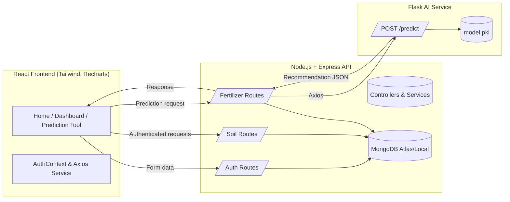

## System Architecture Diagram

### Workflow
- Farmers submit soil parameters through the React interface.
- Express backend validates input, persists soil data, and forwards sanitized payloads to the Flask AI API.
- The AI microservice loads `model.pkl`, performs Random Forest inference, augments the payload with deficiency analysis and suggestions, and returns insights as JSON.
- Backend stores the recommendation history in MongoDB and relays the response to the frontend dashboards and charts.

